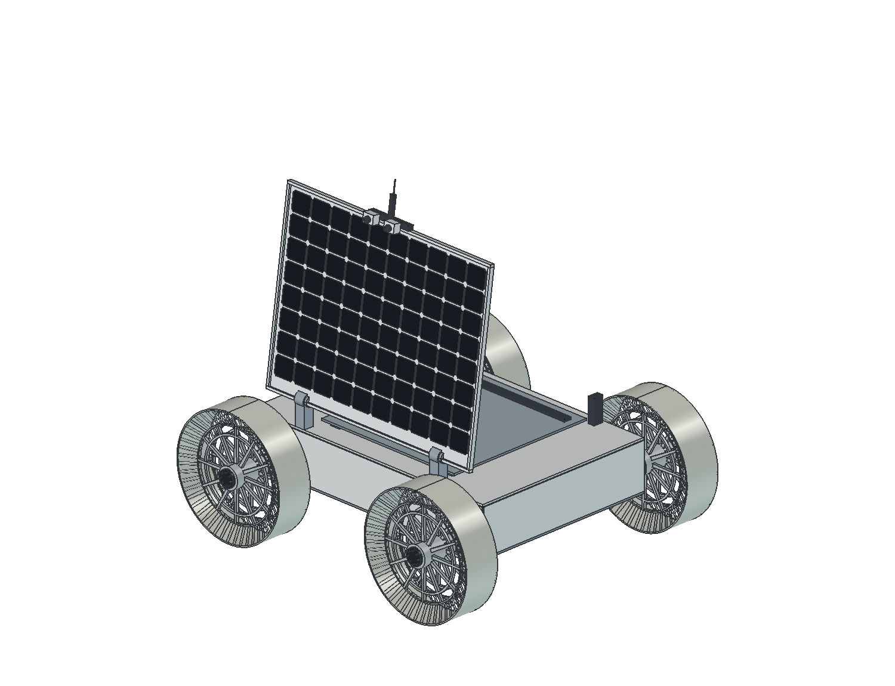

# FLIP rover v5 visual CAD study

This folder contains the newest native FreeCAD delivery file, its input snapshot, the parameter ledger, source imagery, build/presentation scripts, and verification evidence for the 2026-09-30 public-source iteration.

## Open the model

Open [`FLIP_rover_v5.FCStd`](FLIP_rover_v5.FCStd) in FreeCAD 1.1 or later. It opens in the deployed **82° presentation pose**. The 0° stowed pose and other samples are available through the CAD study motion object. Neither pose is a published FLIP flight-hinge limit.



## Rebuild and audit

From this directory in PowerShell, using FreeCAD 1.1:

```powershell
& 'C:\Program Files\FreeCAD 1.1\bin\FreeCADCmd.exe' .\build_v5.py
& 'C:\Program Files\FreeCAD 1.1\bin\FreeCAD.exe' .\present_v5.FCMacro
& 'C:\Program Files\FreeCAD 1.1\bin\FreeCADCmd.exe' .\audit_v5.py
```

The build script regenerates `FLIP_rover_v5_geometry.FCStd` from the frozen `FLIP_rover_v4_input.FCStd` source snapshot. The presentation macro creates/reopens the delivery file and writes named renders. The audit reads the saved delivery and writes `audit_v5.json`. A successful B-rep or sampled pose check is not physical performance or continuous collision proof.

## Delivered evidence

- [`parameters_v5.json`](parameters_v5.json): public facts, study choices, unknowns and units/status.
- [`LUNCO_SIM_RECREATION.md`](LUNCO_SIM_RECREATION.md): USD, Modelica, generic Rust and Twin-local Rhai implementation sequence and verification gates.
- [`REFERENCES.md`](REFERENCES.md): source/claim boundaries and local visual references.
- [`REVIEW.md`](REVIEW.md): measured dimensions, model hash, integrity results, limitations and requirement status.
- `deployed.png`, `stowed.png`, `front.png`, `side.png`, `top.png`, `wheel_face.png`, `wheel_oblique.png`, `hinge.png`, `equipment_cutaway.png`: native FreeCAD presentation views.
- [`build_v5_report.json`](build_v5_report.json), [`presentation.json`](presentation.json), and [`audit_v5.json`](audit_v5.json): rebuild/presentation/audit evidence when generated.

The CAD uses a public 930 mm family wheel diameter and public wheel-detail counts, but all other layout sizes remain visibly labeled study choices unless sourced. It does not claim exact as-built resemblance because no dimensioned FLIP GA, source CAD or released flight ICD was found publicly. No mass or inertia is assigned from visual solids; spring coil solids are render-only.
