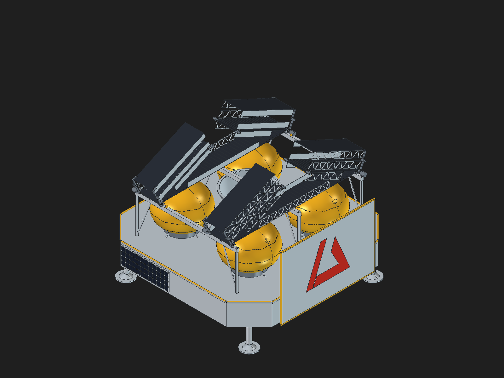

# Griffin 8 — FreeCAD body and articulated rails

Open **[griffin_8_lander.FCStd](griffin_8_lander.FCStd)** in FreeCAD. This is the latest body-completion iteration; the approved Griffin 7 rail geometry and all 12 hinge expressions are preserved. Tested with FreeCAD 1.1.1.



## What is included

- Editable native model with 40 new body features: perimeter frame, upper/lower adapter cones, underdeck webs, tank gussets and leg-root yokes.
- [Structural cutaway](griffin_8_frame_cutaway.png), [underside](griffin_8_body_bottom.png) and [deployed-ramp preview](griffin_8_deployed.png).
- Griffin 7 baseline required by the incremental body builder, plus build, seating, audit and presentation scripts.
- [Reference notes and limitations](griffin_8_body_notes.md) and original validation results. Machine-specific output paths in the published build/presentation reports have been shortened to filenames; measurements are unchanged.

This is a reference-informed older GLAM-like, five-engine study, not flight CAD. Dimensions and mounting details are estimates. The open underside follows the referenced structural architecture. Internal systems and fasteners are not comprehensively modeled.

## Move the ramps

In the model tree, select **RampSettings** (label: ramp controls), then edit **ForeDeployment** or **AftDeployment** in the Data panel from 0 (stowed) to 100 (deployed). Alternatively, use FreeCAD's Python console:

```python
p = App.ActiveDocument.getObject('RampSettings')
p.ForeDeployment = 100
App.ActiveDocument.recompute()
Gui.activeDocument().activeView().fitAll()
```

Return the value to 0 to stow it. Rails and joints are native document geometry/expressions; opening the saved model does not require running a build script.

## Verification boundary

The body audit passed: 40 valid added features, 69 zero-gap attachment checks, and no added-body intersections above 1 cubic millimeter in the static model or at 15 sampled ramp poses. GUI testing confirmed all intended geometry visible after two saved-file reopens. These are geometric checks, not continuous collision detection or engineering qualification. The build report records its intermediate state; the body audit, seating and presentation reports provide the subsequent results.

## Rebuild or audit

Run these commands with FreeCAD's executable directory on PATH, from this folder:

```powershell
FreeCADCmd.exe build_griffin_8_body.py
FreeCADCmd.exe seat_griffin_8_body.py
FreeCAD.exe present_griffin_8.FCMacro
```

The seating script also runs `validate_griffin_8_body.py`. To audit without rebuilding, run `FreeCADCmd.exe validate_griffin_8_body.py`; this only rewrites the audit JSON, not the model. The presentation macro styles, saves and reopens **this package's** Griffin 8 file, and produces previews. Use a backup before rebuilding; the scripts replace their generated Griffin 8 outputs.

Scripts default to their own folder, not a particular user's home directory. Optionally set `GRIFFIN8_WORK_DIR` to a separate working directory containing `griffin_7_lander.FCStd` and `validate_griffin_8_body.py`. Outputs then go there. If executing a script manually through FreeCAD's console, supply its absolute path as `__file__` in the execution namespace.

No new GLB/USD export or simulator physics integration is included in this CAD-only update. Existing Twin assets and local Twin edits were intentionally left unchanged.
