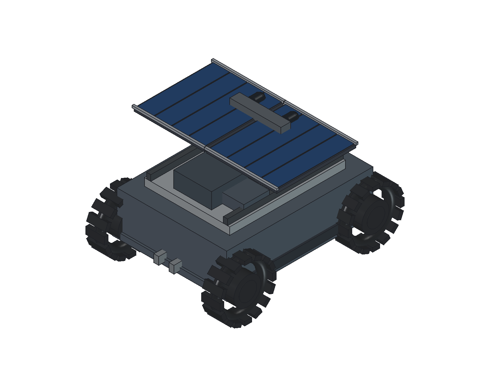
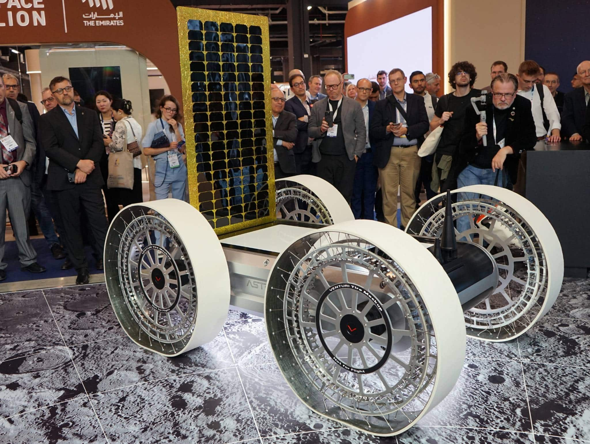

# FLIP requirements, saved FreeCAD model and visual-reference review

Review date: 2026-09-25.

**Finding:** the saved model is a useful named packaging study, but it does not
meet its current solar-articulation contract and has significant mechanical
interferences. It is also visibly different from the official FLIP references.
The saved CAD and the newer generator represent different revisions.

## Evidence and scope

- Reviewed the eight added engineering packages (30 requirements), the five
  existing FLIP visual/component packages (25 requirements), and FR-001–008
  in the Markdown CAD contract.
- Opened the existing document with FreeCAD 1.1.1, inspected its object tree,
  measured OpenCASCADE shapes, computed pairwise intersections and suspension
  solid distances, and rendered native FreeCAD views.
- Source: `C:/Users/salek/OneDrive/Desktop/NASA-lunar-base-model/freecad/FLIP_Rover.FCStd`.
  This is outside the nested Git repository, one directory above it.
- SHA-256: `241babb3157fc6c8f2ef37942261d494af5ac0e7755880a7dfa59151c729e9f9`.
  Source hash was identical before and after inspection. No CAD was regenerated
  or saved over the original.
- The Windows UI helper failed to initialize with a sandbox ACL error. Inspection
  used FreeCAD's native Python/GUI APIs and rendered views, not manual mouse
  operations. No dynamic LunCoSim or hardware qualification test was run.
- [Measured audit](cad_audit.json), [repeatable audit script](../../tools/freecad/audit_flip_existing.py),
  [visual comparison board](comparison.html).

## 1. Second review of the requirements

The added packages are a reasonable coverage outline, but they are not yet a
complete, executable engineering acceptance specification. The previous claim
that the requirements had been validated was too broad: repository structure and
whitespace checks do not establish SysML semantics or requirement quality.

A lexical cross-reference check found **55 definitions and 55 usages across
13 FLIP packages**, with no unresolved local definition or verification-usage
names. This was not a SysML parser/type-checker run. In particular, a string such
as `sourceComponent = "FlipRequirements::FlipRover"` is documentation, not a
typed allocation or relationship.

| Priority | Requirement issue | Recommended correction |
|---|---|---|
| High | FR-003/004 implementation status describes the newer macro, not the saved FCStd. | Record model revision/hash separately from generator revision. Mark the saved-file articulation as absent. |
| High | FR-006 makes ramp deployment part of release. Astrolab's 2026 announcement describes ramp-free top-deck egress. | Make touchdown, restraint release and clearance common requirements; keep ramps conditional on an explicit study branch. [Mission source](https://www.astrolab.space/2026/05/18/astrolab-announces-nasa-payloads-for-upcoming-mission-to-the-moon/) |
| High | FSR sourceFact attributes independent wheel-flank suspension to FLIP. | Remove the unsupported attribution: that wording appears under FLEX-C on the current supplier page. Retain the suspension as a study architecture until FLIP-specific evidence establishes it. [Supplier](https://venturi.space/rovers/) |
| High | Chassis/overall envelope, forward direction and mount datum are ambiguous or inconsistent between CAD and SysML. | Define base box, full chassis bounds and whole-vehicle bounds separately. State signed forward axis and frame transforms. Reconcile configuration before changing dimensions. |
| High | Every new requirement contains TBD acceptance limits and several combine multiple obligations. | Split independently verifiable behaviors, assign requirement/TBD owners, units, threshold, conditions, tolerance, verification method and closure evidence. Keep unresolved performance unverified. |
| Medium | 450 kg is labelled only an inferred midpoint. | Current Venturi FLIP information explicitly lists 450 kg, 30 kg payload and 20 km/h maximum. Record these as dated supplier claims; mass inclusion and speed test conditions still require an ICD. Do not adopt 20 km/h as a safe commanded speed. [Supplier](https://venturi.space/rovers/) |
| Medium | Battery packaging is a single generic box and body mounting is assumed. | The supplier media kit describes two FLIP packs behind the solar panels. Add pack identity and packaging allocation; this does not prove the batteries move with the array. [Media kit, printed p.8](https://venturi.space/wp-content/uploads/2025/06/en-venturi-space-media-kit.pdf) |
| Medium | FIF-002 only addresses generic payload interfaces. | Allocate the announced METAL, LRA, LDES and Lunar LiDAR payloads, with mounting and field-of-view/keep-out constraints. LRA is passive; it must not inherit a generic powered-payload assumption. [Mission source](https://www.astrolab.space/2026/05/18/astrolab-announces-nasa-payloads-for-upcoming-mission-to-the-moon/) |
| Medium | FSD-001 prescribes a single revolute joint as if it were flight architecture. | Keep this as a named study implementation unless a source establishes the actual deployment mechanism; public “collapsible” does not establish axis or joint count. |
| Medium | New engineering subjects are contract parts with string references; tests and evidence are planned. | Add actual model allocations/refinement relationships supported by the project parser and register observers only when implemented. |
| Medium | FTE-004 mixes radiation, vacuum, lubrication and thermal cycling. | Separate environmental requirements; specify radiation dose material basis, single-event criteria and mission exposure. |
| Medium | FMO-003 and FAV-003 overlap safe-state behavior. | Let mission requirements define the safe outcome and avionics requirements allocate detection/recovery without duplicating thresholds. |

Other unclosed topics are configuration-controlled visual references, explicit
CAD-to-USD object mapping, reopen/persistence tests for Python joint controllers,
full swept-volume checks, payload optical clearance, braking/hold on slopes,
EMC/EMI allocations and sensor/actuator calibration.

The eight new verification definitions are correctly labelled PLANNED. Retain
that status. A test of visual presence cannot establish power, mobility,
survival or fault-tolerance performance.

## 2. Validation of the actual saved FreeCAD document

### Measured results

| Measurement | Result |
|---|---|
| Document objects / shape features | 69 objects / 21 Part::Feature shapes |
| Shape validity | 21/21 pass FreeCAD Shape.isValid() |
| Wheel stations | Wheel_FL, Wheel_FR, Wheel_RL, Wheel_RR |
| Declared axes | X lateral, Y up, Z longitudinal; signed forward not stated |
| Base chassis dimensions stored as properties | 1800 mm width × 700 mm height × 2400 mm length |
| Actual MainChassis bounds, including extensions | 1880 × 700 × 2470 mm, X/Y/Z |
| Overall saved-pose bounds | 2376 × 1872.08 × 3074.15 mm, X/Y/Z |
| Wheel feature bounds | 306 mm wide × 974.15 × 974.15 mm; properties say width 280 mm and radius 450 mm |
| Lowest geometry | Y = −37.08 mm, due to tread blocks extending beyond nominal radius |
| Mast full bounds / stored Height | 715 mm vertical / 550 mm; different measurement definitions |
| Solar representation | Two fixed horizontal wings; eight cell-strip solids |
| Articulation | No SolarArrayJoint, SolarArrayPanelBody or RoverBody object |
| Mass/density/inertia properties | None found under those property names; 450 kg appears as spreadsheet text |
| Source preservation | SHA-256 unchanged |

The wheel-size discrepancy is between nominal parameters and the full tread
bounds; it is not proof that the supplier's wheel diameter is wrong. Likewise,
Y below zero is a ground-datum issue only if Y=0 is intended as the ground.

### Mechanical findings

1. **All four wheels intersect MainChassis.** Each computed common volume is
   approximately 6,707,029 mm³ (6.707 litres). SideProtectionRails also intersect
   each wheel. These overlaps require wheel-clearance review before steering
   or suspension motion can be considered plausible.
2. **Suspension arms do not connect to their knuckles.** Each Suspension feature
   contains two solids whose minimum separation is 737.5 mm. This is a geometric
   gap in the authored carrier, not a measured physical suspension travel.
3. **Solar panels intersect sensors.** Panel/mast common volume is approximately
   2,151,006 mm³; panel/camera common volume is approximately 1,955,451 mm³.
   Cell surfaces intersect those features too. The saved pose already fails
   clearance; an articulation sweep cannot be run because no joint exists.
4. **Power-controller packaging overlaps.** It intersects PayloadRails by
   2,593,500 mm³ and BatteryBox by 672,000 mm³.
5. **Hinges are decorative and detached from the panels.** SolarHinges ends at
   Y=1590 mm; panels start at Y=1680 mm, leaving at least a 90 mm vertical gap.
   There is no assembly constraint establishing a hinge connection.
6. **The chassis is a solid proxy.** Its “shell” label does not describe a
   hollow enclosure. It cannot supply a physical mass estimate without a
   deliberate material/wall-thickness model.

The audit found 27 intersecting feature pairs. That is **not 27 independent
defects**: some contacts/overlaps between structural proxy parts may be
intentional. The cases above were selected because they affect clearance,
connectivity, or separately identified equipment.

### Existing CAD contract: FR-001–008

| ID | Saved CAD result | Evidence |
|---|---|---|
| FR-001 | Partial | Named chassis, deck, battery and mast exist; physical replaceability and payload interface are not established. |
| FR-002 | Partial | Four large wheel features exist. Spoked/deformable construction and operational all-wheel steering are absent. Steering is a string property. |
| FR-003 | Fails pose/assembly portion | Fixed two-wing geometry, frames, cells and decorative hinges exist; no stowed/deployed mechanism or panel-mounted moving sensor assembly. |
| FR-004 | Fail | Named revolute controller and separate moving panel body are absent from this FCStd. |
| FR-005 | Partial | Battery/controller are fixed features under Payload/Power; packaging source assumption needs revision and controller overlaps other parts. |
| FR-006 | Fail CAD portion | No named adapter datum, bolt pattern or release hardware in the object inventory. Landed/released behavior requires the separate runtime scene. |
| FR-007 | Partial | Stable groups and wheel names are useful, but no separate panel/joint body; editable groups do not prove interchangeable mechanical interfaces. |
| FR-008 | Partial | Source URL and proxy labels are present; date/revision mapping, dimension consistency and updated supplier attribution are incomplete. |

### Existing SysML visual/component scope

These requirements target USD paths and types. The following are CAD analog
observations, not passing verdicts for their runtime fixtures.

| IDs | CAD observation / remaining verification |
|---|---|
| FGV-001–005 | Four-wheel presentation exists, but steering and collapsible-array behavior do not. CAD does not consume SysML dimensions; no aggregate runtime result was produced. |
| FCC-001–004 | Chassis/deck named concepts exist; LowerFrame/WhiteEquipmentBox USD topology is not mapped. Width/length differ from the 4.40/2.76 m SysML allocation. USD collision ownership remains untested. |
| FWW-001 | Four named wheel stations observed; CAD count portion agrees. |
| FWW-002 | Tire/hub/cap are compound geometry rather than separate named CAD subparts; nominal radius differs from full tread bounds. |
| FWW-003 | No wheel steering joints/controllers; source steering values are not applied. |
| FWW-004–005 | CAD does not read the SysML station table. CAD track/wheelbase are 1.9/2.1 m; SysML station separation is 3.5/2.3 m before any datum reconciliation. |
| FWW-006 | No referenced detached suspension component; CAD uses local compound shapes. |
| FSR-001 | Unsupported FLIP independent-suspension attribution requires source correction. |
| FSR-002 | CAD has Y-up metadata, but millimetres and globally placed shapes differ from the wheel-hub-local SI component contract. |
| FSR-003–004 | CAD carriers contain arm and knuckle, lack the specified strut, have disconnected solids and do not match the SysML component dimensions. |
| FSR-005–006 | USD collision policy and transform order are outside this FCStd-only inspection. |
| FSP-001–004 | Mast and fixed array exist, but no identified antenna object; mast datum definitions differ and solar deployment/status does not match the articulated CAD contract. Exact USD paths and provenance consumption remain untested. |

### All 30 new engineering requirements

“Partial” means some supporting CAD evidence exists, not that the requirement
is satisfied. “Unverified” means the necessary analysis, runtime behavior or
hardware evidence is outside this document. No new engineering requirement
is closed by this audit.

| ID | Assessment against saved CAD |
|---|---|
| FBL-001 | Fails configuration consistency: generator, saved CAD and SysML differ. |
| FBL-002 | Partial: axis metadata exists; mount datums, signed forward axis and export round-trip evidence are missing. |
| FBL-003 | Unverified: no physical mass/inertia allocation or loaded stability analysis. |
| FBL-004 | Partial: provenance labels exist; source revisions and representation consistency do not. |
| FMO-001 | Unverified: no mission timeline, traverse duty cycle or illumination analysis. |
| FMO-002 | Unverified: no egress behavior; CAD also lacks the rover mounting/release interface. |
| FMO-003 | Unverified: CAD cannot demonstrate safe-state behavior. |
| FMB-001 | Unverified performance; observed wheel/chassis overlap is a geometric blocker. |
| FMB-002 | Unverified behavior; string steering labels have no mechanism and architecture conflicts remain. |
| FMB-003 | Unverified: no solver torque/speed/electrical integration test in FreeCAD. |
| FMB-004 | CAD portion fails connectivity/clearance; loads, deformation and travel remain unverified. |
| FEP-001 | Unverified: a battery spreadsheet value is not a mission energy budget. |
| FEP-002 | Unverified: no BMS/protection test or model. |
| FEP-003 | Unverified: no electrical connector, bus or grounding ICD. |
| FEP-004 | Partial geometry only: panels and cell strips exist; no generation/degradation model. |
| FSD-001 | CAD prerequisite absent; runtime body/joint verification not performed. |
| FSD-002 | Fails saved-pose clearance: mast and cameras intersect panel geometry. |
| FSD-003 | Unverified: decorative hinges provide no actuator, end-stop, latch or harness model. |
| FTE-001 | Unverified: no thermal boundary conditions/material analysis. |
| FTE-002 | Unverified: no coupled night-survival analysis or test. |
| FTE-003 | Unverified: no dust test or allocated degradation limits. |
| FTE-004 | Unverified: no radiation/material qualification evidence. |
| FAV-001 | Unverified: no link budget or communication architecture. |
| FAV-002 | Partial visual cameras only; no sensing/localization model and camera packaging intersects the array. |
| FAV-003 | Unverified: no fault-detection/recovery logic. |
| FAV-004 | Unverified: no telemetry acquisition/time-alignment evidence. |
| FIF-001 | CAD interface absent: no adapter datums/restraints/umbilicals. |
| FIF-002 | Partial: deck and rails exist; named mission payloads, optical keep-outs and ICDs are absent. |
| FIF-003 | Unverified: no materials, load cases or structural qualification. |
| FIF-004 | Partial: this audit supplies revision-matched CAD evidence, but runtime/hardware evidence and acceptance limits remain open. |

## 3. Visual comparison with public FLIP references

I inspected native isometric, front and side CAD views against official
Astrolab renders, a Venturi render and a dated Venturi prototype photograph.
These references represent different design dates; none is a dimensioned
flight CAD release.

| Reference | Type / scope | Local evidence |
|---|---|---|
| [Astrolab FLIP page](https://www.astrolab.space/flip-rover/) | Official render beside Griffin; white array reverse side and large open wheels | [Drive-out](reference_astrolab_driveout.jpg) |
| Same Astrolab page | Official elevated render showing array face and rover/lander context | [Elevated view](reference_astrolab_detail.jpg) |
| [Venturi rover page](https://venturi.space/rovers/) | Official render with upright gold-backed cell array and open wheel construction | [Render](reference_venturi_flip.jpg) |
| [Venturi, 15 Oct 2024](https://venturi.space/en/article/venturi-space-and-venturi-astrolab-introduce-lunar-rover/) | Development prototype at IAC; wheels visibly marked “Not for flight” | [Prototype photo](reference_venturi_iac2024.jpg) |

**What is good:** four large outboard wheels, a central equipment/deck volume,
solar and camera concepts, independently identifiable major parts, named wheel
stations, useful symmetry, explicit axis convention and honest study labels.
Those are worth retaining when rebuilding the detailed assembly.

| Feature | CAD versus observed references | Feedback |
|---|---|---|
| Solar silhouette | CAD is a high horizontal two-wing canopy. All inspected references show an upright large array in the presented configuration. | Highest visual mismatch. Establish the chosen reference revision and make the shown deployed pose match; preserve a separately verified stowed pose. |
| Wheels | CAD uses dark torus-like tires, large solid hub disks and chunky tread blocks. References show open spoke/web structure and continuous broad bands. | Rebuild the visible wheel construction. Do not infer stiffness, material or exact dimensions from appearance. |
| Chassis proportions | CAD is a tall, long rectangular slab with stacked equipment. References show a lower central body and wheels dominating the silhouette. | Reduce visual bulk only after choosing the dimensional baseline; this is qualitative image comparison, not photogrammetric measurement. |
| Sensors | CAD's central mast/cameras intersect the horizontal array. References show compact hardware at/above the upright panel; the prototype has its own hardware arrangement. | Remove intersections and allocate camera fields of view; avoid inventing sensor identity from shape alone. |
| Battery packaging | One generic CAD enclosure; supplier literature describes two packs behind panels. | Introduce separately traceable battery-pack envelopes when the selected revision/ICD confirms placement. Do not infer articulation. |
| Suspension | CAD arms/knuckles are disconnected and hidden in/intersecting the body. | Correct mounting continuity before surface detail. Exact FLIP suspension remains unresolved from the sources inspected. |
| Solar cells | CAD contains eight broad cell-strip solids. References display many individual cells in organized groups. | Improve cell pattern for visual fidelity after the array architecture is settled. |
| Surface finish | Captured CAD is predominantly dark grey; references vary between white/silver and gold surfaces. | Match the selected reference, not a mixture of generations. Render lighting differs, so colour alone is not a material verification. |
| Payload/lander details | Generic deck/rails; no mission payload or adapter geometry. | Add named interface envelopes and keep-outs from actual ICDs, rather than decorative boxes. |

The prototype is valuable visual evidence, but its “Not for flight” wheel labels
prevent treating it as proof of the final flight build. The Astrolab and Venturi
renders also differ in finish and panel details. Four wheels are supported by
these visual references; exact tire dimensions and steering behavior are not.

## Recommended repair sequence

1. Pin the target reference revision and the authoritative saved CAD/generator.
   Correct the requirement source/status issues above before accepting geometry.
2. Reconcile nominal dimensions, full envelopes and coordinate datums.
3. Rebuild one connected wheel station, verify clearance, then repeat it at the
   other stations. Add real steering/suspension DOFs only with explicit assumptions.
4. Replace the fixed canopy with the selected array assembly, hinge/supports,
   actuator envelope and clear stowed/deployed poses. Sweep for interference.
5. Place sensors and two battery-pack envelopes with source/ICD status; resolve
   camera occlusion, controller overlaps and optical keep-outs.
6. Add lander restraint/release datums and allocated mission payload interfaces.
7. Refine wheel/cell detail and finish. Reopen the saved document and rerun
   geometry, articulation and export checks before promoting it to the Twin.
8. Close power, thermal, mobility and avionics requirements with their respective
   models/tests; CAD inspection alone cannot close them.

This review leaves the existing CAD and requirements unchanged. The new outputs
are the audit script, measured report, native captures and reference comparison.
